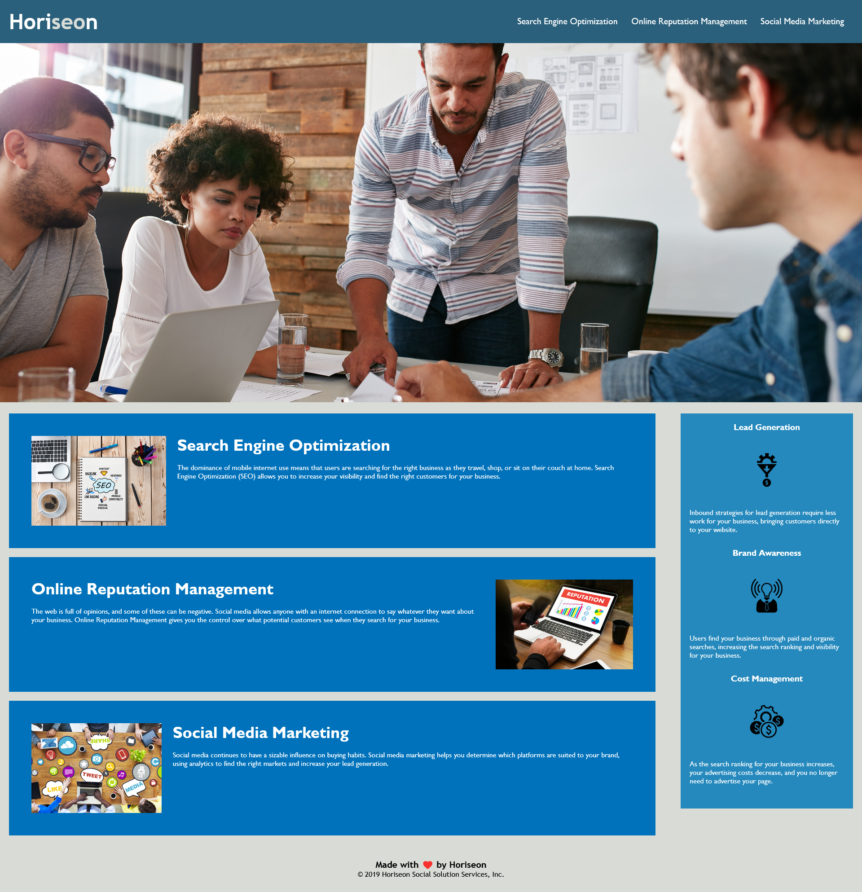

# Horiseon - Code Refactor Challenge

## [Display Website](https://purrzim.github.io/challenge-one/)

## About this Project

This project is for a HTML and CSS code refactor challenge assigned by the University of Toronto coding bootcamp. The purpose of this challenge was to take the exsiting code and bring it to meet accessibilty standards as well as tiding the HTML and CSS.

## Screenshot
